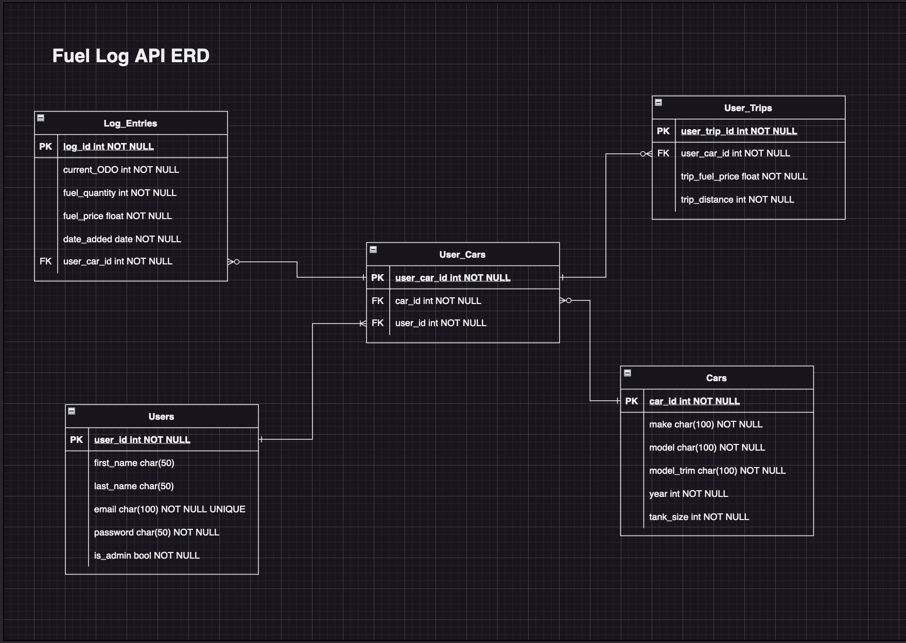

# Fuel Log API

#### Installation

Requirements:
- PostgreSQL    :       "psql"
- Python 3         :        (Python 3.11.3 used)

##### Database setup

#### The problem this API app is trying to solve

With fuel prices rising steadily over the last 5 years, more car owners are looking for ways to keep running costs down. This application will provide a way for users to track their fuel consuption from bowser to bowser, while providing multiple forecasts and estimations based on their fuel consumption and current fuel costs at the bowsers which will be useful for budgeting purposes.

- The app will help the user budget and plan ahead for fuel expenses for the month
    - It will return the total cost of fuel for a time period and the total distance travelled within that timeframe.
- The user can calculate the esitmated cost of a trip by providing the distance and the price of fuel
- The average consumption per 100 km is returned each time the user calculates the cost of a trip. This consumption rate is used to estimate the total cost of the trip.
- It allows users to add multiple cars to their list to track separately.

## REST API Resources

Below is a full listing of all available endpoints. For more information on a particular endpoint, click the resource name.

#### User Access and account management

| Resource | Description |
| --------------------- | ---------- |
|[POST    /login](./docs/endpoints.md#post-login) | allows existing user to authenticate|
|[POST   /register](#register) | allows a user to register|

## ERD

#### Entities

- Users
- Log Entries
- Cars
- User Cars
- Trips

## Third Party Services

pip install flask, flask-sqlalchemy, flask-bcrypt, flask-marshmallow, psycopg2-binary, flask-JWT-Extended, orjson marshmallow-sqlalchemy, python-dotenv
